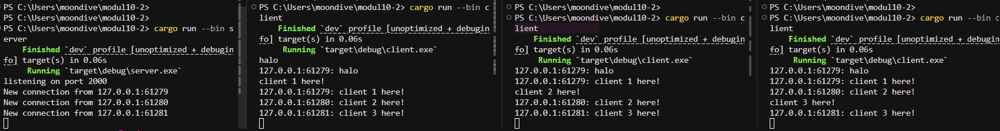

# Modul 10 Asynchronous Programming

## Reflection 2.1.

Berdasarkan hasil eksekusi pada screenshot tersebut, program dijalankan dengan mengeksekusi perintah cargo run --bin server terlebih dahulu untuk memulai server yang listen pada port 2000, kemudian menjalankan cargo run --bin client pada tiga terminal yang berbeda. Ketika sebuah pesan diketik di salah satu jendela client, pesan tersebut dikirim ke server secara asynchronus dan segera disebarkan ke semua client lain yang sedang terhubung. Hal ini terlihat jelas pada terminal di mana setiap client menerima pesan yang dikirim oleh client lainnya dengan identitas unik berupa alamat IP dan nomor port pengirimnya, yang menunjukkan bahwa model pemrograman asynchronus berhasil menangani banyak koneksi secara bersamaan dengan efisien.
