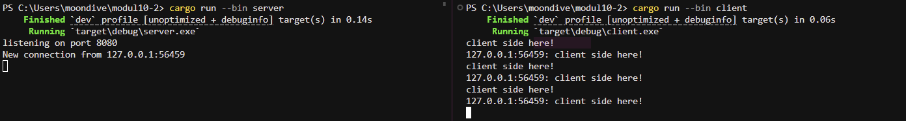
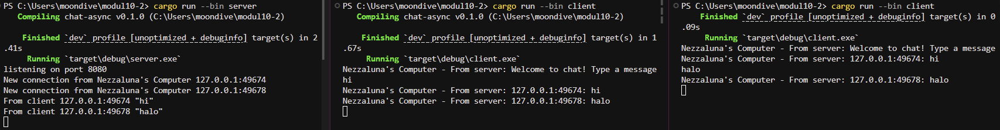

# Modul 10 Asynchronous Programming

## Reflection 2.1.

Berdasarkan hasil eksekusi pada screenshot tersebut, program dijalankan dengan mengeksekusi perintah cargo run --bin server terlebih dahulu untuk memulai server yang listen pada port 2000, kemudian menjalankan cargo run --bin client pada tiga terminal yang berbeda. Ketika sebuah pesan diketik di salah satu jendela client, pesan tersebut dikirim ke server secara asynchronus dan segera disebarkan ke semua client lain yang sedang terhubung. Hal ini terlihat jelas pada terminal di mana setiap client menerima pesan yang dikirim oleh client lainnya dengan identitas unik berupa alamat IP dan nomor port pengirimnya, yang menunjukkan bahwa model pemrograman asynchronus berhasil menangani banyak koneksi secara bersamaan dengan efisien.

## Reflection 2.2.

Berdasarkan hasil eksekusi pada screenshot tersebut, port berhasil diubah menjadi 8080 dan program tetap berjalan dengan lancar. Modifikasi ini dilakukan pada dua sisi, yaitu sisi server yang diatur untuk listen pada port 8080 dan sisi client yang alamat URI nya diperbarui agar mengarah ke port yang sama untuk memastikan koneksi berhasil tersambung. Protokol yang digunakan dalam proogram ini adalah WebSocket, yaitu dengan skema ws dalam URI koneksi yang didefinisikan pada file seperti client.rs. Keberhasilan modifikasi ini dibuktikan dengan munculnya pesan "New connection" pada terminal server dan kemampuan client untuk mengirim serta menerima pesan secara asynchronus melalui protokol tersebut.

## Reflection 2.3.

Berdasarkan hasil eksekusi pada screenshot tersebut, modifikasi dilakukan untuk menambahkan informasi alamat IP dan nomor port pengirim ke dalam setiap pesan yang dikirimkan. Karena sistem saat ini belum memiliki mekanisme nama pengguna, informasi alamat socket digunakan sebagai identitas unik untuk membantu memahami bagaimana pesan diteruskan antar satu sama lain di dalam jaringan. Hal ini terlihat jelas pada jendela terminal di mana setiap pesan yang diterima sekarang memiliki awalan alamat pengirim, yang membuktikan bahwa server secara asynchronus berhasil mengolah metadata koneksi dan menyebarkannya ke seluruh client yang terhubung secara real-time.
